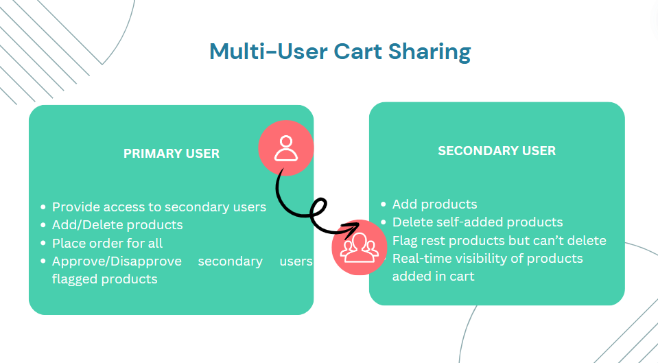

# Add2Cart
Cart sharing and group ordering for shop experience in the Telco Applications.

## **Overview**

This project aims to streamline the upgrade and purchase process within e-commerce applications, especially in the context of telecom apps. It allows a primary account holder to share their cart, device upgrade plans, or product selections with multiple account holders (e.g., family members, friends) in real-time. By integrating cart-sharing features, the app facilitates easy collaboration between users on upgrades and purchases without manual coordination outside the app.

[

## **Features**

1. **Cart Sharing & Group Ordering**:
    - Share your cart with other account holders via a link, QR code, or NFC.
    - All users can view and modify the cart in real time.
    - No login is required for shared users to access and change the cart.

2. **Real-Time Updates**:
    - All changes to the shared cart are reflected in real-time for all participants.
    - Ensure a seamless, collaborative shopping experience.

3. **Multiple Products Support**:
    - Add, update, or remove multiple products from the shared cart.
    - Other users can modify the same cart simultaneously.

4. **Notifications**:
    - Notifications are triggered when users make changes to the cart.

## **How Multi-user cart sharing work?**

## **Tech Stack**

### **Frontend**:
- **Android XML**: For building responsive and intuitive user interfaces.
  
### **Backend**:
- **Android Java**: For handling the server-side logic and communication with databases.

### **Database**:
- **Firebase**: For storing cart data and user information.

### **Real-Time Collaboration**:
- **WebSockets**, **Firebase Real-time Database**: To enable real-time updates and synchronization of the cart data.

### **Additional Features**:
- **NFC** or **QR Code libraries**: For implementing innovative sharing mechanisms.

---

## Demo
APK Link: [Drive link]()

